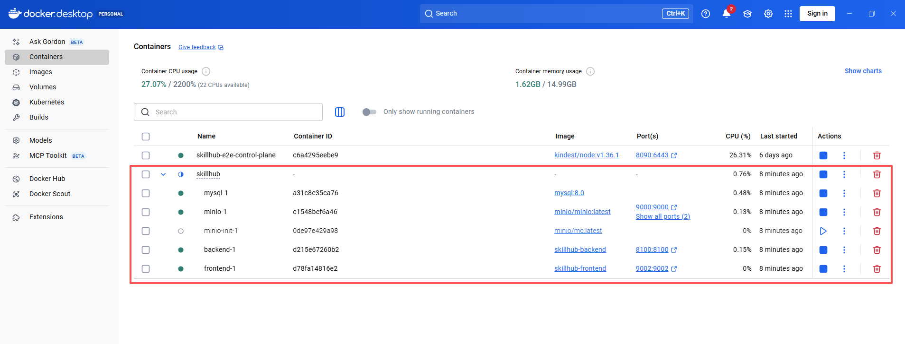
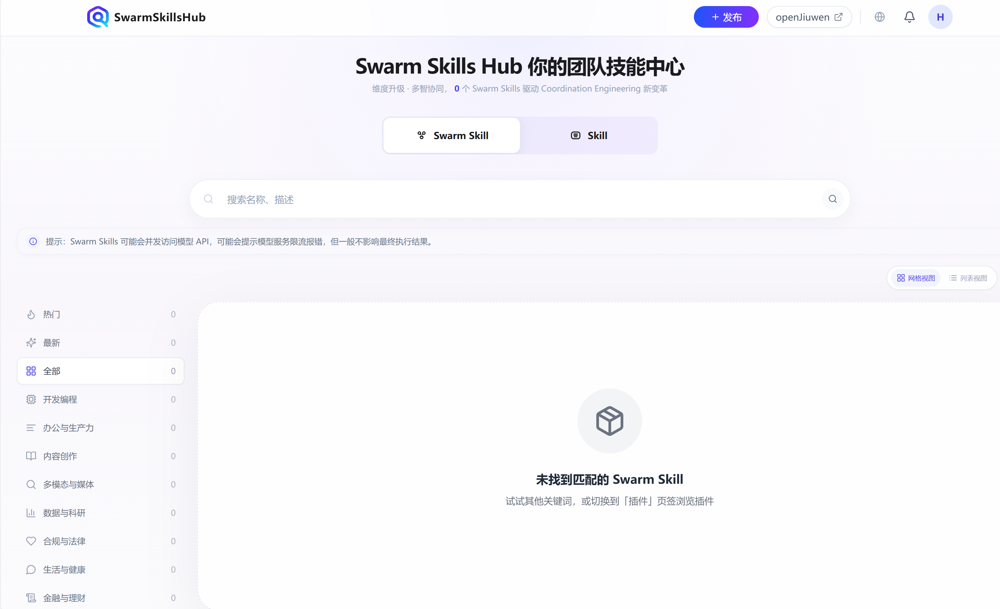
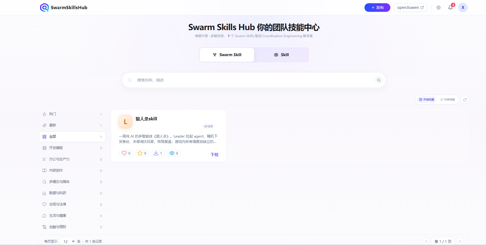
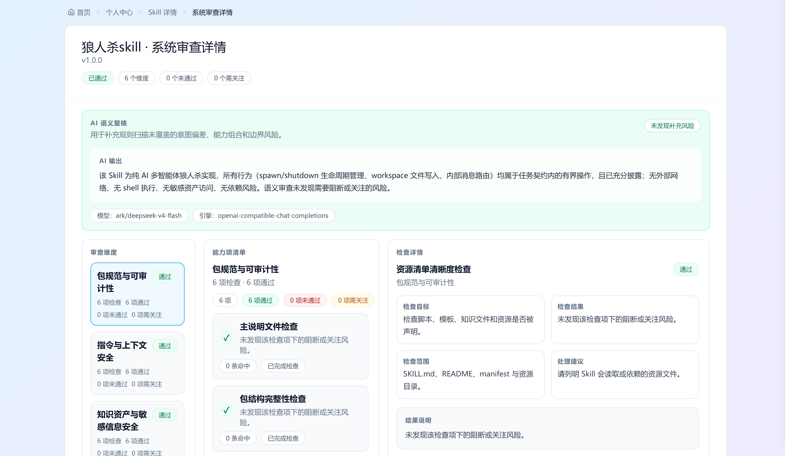
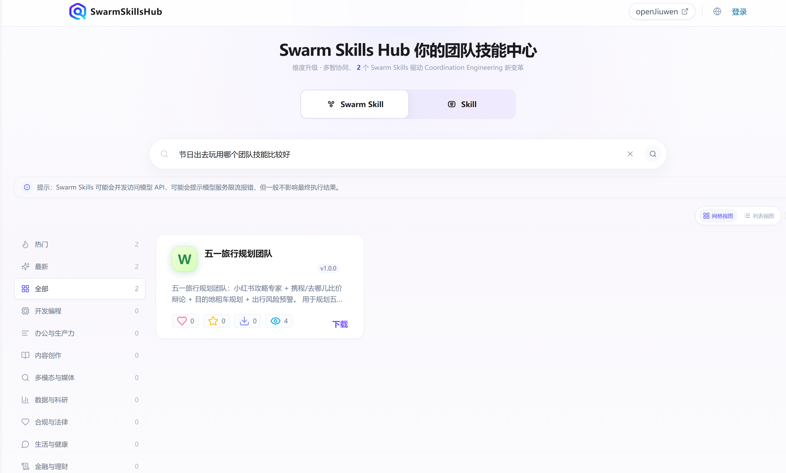
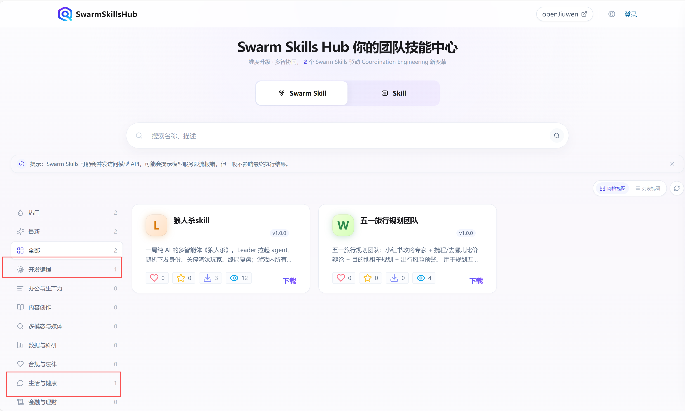

# SkillHub 一键部署（Docker Compose）

本文说明如何用 Docker Compose 一条命令启动 SkillHub 全套服务：MySQL、MinIO、Backend、Frontend 四个容器，外加一个自动建 Bucket 的初始化容器。所有依赖都是容器内全新的独立环境，不要求宿主机安装 MySQL 或 MinIO。步骤以 **Windows / PowerShell** 为例。

适用场景：本地快速试用和联调。生产或多副本部署见 [K8s 方式安装指导](../K8s方式安装/SkillHub安装指导.md)。如果宿主机已有 MySQL 或 MinIO 并希望复用，请使用 [Docker 方式安装指导](./SkillHub安装指导.md)。

## 1 环境要求

| 依赖 | 说明 |
|------|------|
| **Docker Desktop** | 推荐 WSL 2 后端；`docker info` 能正常输出，且支持 `docker compose` 命令 |
| **登录与鉴权** | 按使用场景配置。浏览公开内容无需配置；通过 Web 页面登录、发布和审核时需配置 OAuth，见第 3 节 |

> 仅浏览公开市场内容时无需登录。若要发布或审核 Skill，请先完成第 3 节。

## 2 获取代码

```powershell
git clone https://gitcode.com/openJiuwen/skillhub.git
cd skillhub
```

后续命令默认从 **SkillHub 仓库根目录**开始执行。

## 3 准备 OAuth 应用和审核账号

需要通过 Web 页面登录、发布和审核 Skill 时，按 [OAuth 登录配置](../../6.%20运维指南/基础部署/OAuth登录配置.md) 完成准备（仅浏览公开内容可跳过本节）。完成后记录以下值，供第 4 节填写 `.env.docker`：

- GitCode OAuth 应用的 Client ID 和 Client Secret（应用主页和回调地址使用 `http://skillhub.local:9002`）
- 审核账号的 GitCode 登录名（需与发布账号不同，审核账号不能审核自己发布的 Skill）

## 4 配置 .env.docker

将仓库根目录的 **`.env.example`** 复制为 **`.env.docker`**：

```powershell
Copy-Item ".env.example" ".env.docker"
```

编辑 `.env.docker`，填写以下配置。密码等取值请避免 `#`、空格和引号，防止解析异常：

```ini
# 数据库账号；backend 以此专用账号连接（不能为 root，compose 首次启动会自动创建并授权）
DB_USER=skillhub
# 数据库密码；同时作为容器内 MySQL 的 root 密码（root 仅用于运维，不对外发布端口）
DB_PASSWORD=请替换为强密码
STORE_DB_NAME=openjiuwen_market

# 对象存储；同时作为容器内 MinIO 的 root 凭证
MARKET_S3_ACCESS_KEY=skillhub-admin
MARKET_S3_SECRET_KEY=请替换为强密码
MARKET_BUCKET_NAME=openjiuwen-market-test
MARKET_S3_ENDPOINT=http://skillhub.local:9000

# GitCode Web 登录；仅浏览公开内容时设为 false 并省略以下 OAuth 配置
MARKET_GITCODE_OAUTH_ENABLED=true
MARKET_GITCODE_OAUTH_CLIENT_ID=你的GitCode客户端ID
MARKET_GITCODE_OAUTH_CLIENT_SECRET=你的GitCode客户端密钥
MARKET_GITCODE_OAUTH_REDIRECT_URI=http://skillhub.local:9002/api/v1/auth/oauth/gitcode/callback
MARKET_GITCODE_OAUTH_SCOPE=user_info
MARKET_OAUTH_FRONTEND_ORIGIN=http://skillhub.local:9002

# 人工审核管理员；填写第 3 节准备的审核账号登录名
MARKET_REVIEW_ADMIN_USERNAMES=reviewer_login
```

两点说明：

- MySQL 和 MinIO 由 compose 自动创建并初始化，账号密码直接取自上面的值，无需手动建库建桶。`DB_HOST` 不用修改，compose 内部自动通过服务名访问 MySQL。
- `MARKET_S3_ENDPOINT` 保持 `http://skillhub.local:9000`。Backend 容器和浏览器都通过它访问 MinIO，预签名下载地址也基于它生成：浏览器经第 3 节配置的 hosts 映射解析 `skillhub.local`，Backend 容器则由 compose 注入的 `extra_hosts` 解析到宿主机。不要改成 `host.docker.internal`，该名称只保证在容器内可解析，浏览器所在宿主机上未必可用。

## 5 一键启动

```powershell
docker compose -f docker/docker-compose.yml --env-file .env.docker up -d --build
```

首次运行需要构建 Backend 和 Frontend 镜像，耗时取决于网络，后续启动秒级完成。构建时 PyPI 或 apt 下载缓慢、超时，可将 `.env.docker` 末尾「构建加速」小节的配置取消注释后，重新执行上述命令。

验证：执行 `docker compose -f docker/docker-compose.yml ps`，mysql、minio、backend、frontend 均为 `running`，minio-init 显示 `Exited (0)` 属正常，它是一次性建桶任务，完成后自动退出。在 Docker Desktop 中可以看到 skillhub 分组下的 5 个容器：



## 6 验证

### 6.1 健康检查

```powershell
curl.exe http://skillhub.local:8100/api/health
curl.exe http://skillhub.local:9002/health
curl.exe http://skillhub.local:9002/api/health
```

均有正常响应即服务可用。Windows PowerShell 5.1 中 `curl` 是 `Invoke-WebRequest` 的别名，输出格式不同，这里用 `curl.exe` 获取原始响应。

### 6.2 浏览器验证

浏览器访问 `http://skillhub.local:9002`。页面能够正常打开且市场内容可以加载，说明 Frontend 与 Backend 已正常连通。全新部署的市场首页为空，属正常现象：



### 6.3 完整发布流程

使用准备的发布账号和审核账号，继续验证完整发布流程：

1. 使用发布账号登录并提交 Skill，确认状态为“人工审核中”。
2. 使用独立审核账号登录，在“待审核”中通过该 Skill。
3. 返回市场页面，确认该 Skill 已可见。



## 7 可选能力

完成基础部署后，以下能力可按需启用，不启用时核心功能不受影响。配置都写在 `.env.docker` 中，改完后执行 `docker compose -f docker/docker-compose.yml --env-file .env.docker up -d backend` 重建 Backend 容器生效。

| 能力 | 说明 | 不启用时的表现 |
|------|------|----------------|
| **系统审查** | 发布前自动检测安全风险 | 直接进入人工审核 |
| **检索系统** | 语义搜索，比关键词匹配更准 | 搜索退化为关键词匹配 |
| **分类标签** | 新发布 Skill 自动打分类标签，用于首页类别展示 | 首页无类别，Skill 无分类标签 |

### 7.1 系统审查

在 `.env.docker` 中配置，模型接口需兼容 OpenAI Chat Completions：

```env
MARKET_SKILL_REVIEW_ENABLED=true
MARKET_SKILL_REVIEW_MODEL_BASE_URL=https://your-review-model-service/v1
MARKET_SKILL_REVIEW_MODEL_API_KEY=***
MARKET_SKILL_REVIEW_MODEL_NAME=test-review-model
MARKET_SKILL_REVIEW_MODEL_TIMEOUT_SECONDS=300
```

- 关闭（默认）：发布后直接进入人工审核
- 开启：先系统审查；通过后转为「待人工审核」，不通过则发布失败
- 开启时若未配齐模型参数，发布会被拒绝
- 覆盖普通 Skill 与 SwarmSkill

验证：重建 Backend 后提交 Skill，状态先显示「系统审查中」即生效。审查完成后可在「系统审查详情」页查看各维度检查结果与 AI 语义复核结论：



### 7.2 检索系统

开启语义搜索需要一个向量模型（Embedding）服务，接口兼容 OpenAI 的 `/v1/embeddings` 即可。

在 `.env.docker` 中配置：

```env
# 向量模型（必需）
MARKET_RETRIEVAL_EMBEDDING_API_BASE_URL=https://your-embedding-service/v1
MARKET_RETRIEVAL_EMBEDDING_API_KEY=***
MARKET_RETRIEVAL_EMBEDDING_MODEL=test-embedding-model
MARKET_RETRIEVAL_EMBEDDING_BATCH_SIZE=16

# 检索策略（默认值，无需改动）
MARKET_RETRIEVAL_BUILD_METHOD=embedding_bm25
MARKET_RETRIEVAL_SEARCH_METHOD=embedding

# 定时任务
MARKET_RETRIEVAL_REBUILD_CRON=0 * * * *
MARKET_RETRIEVAL_REBUILD_ON_STARTUP=true
```

模型服务若运行在宿主机上，容器内用 `host.docker.internal` 访问；运行在其他机器上则填写对应地址。单实例无需配置 Redis。

验证：重建 Backend 后执行 `docker compose -f docker/docker-compose.yml logs backend | Select-String "retrieval index rebuild run end"`，有输出就表示索引建好了。然后在市场页面用一个**近义词**搜索——例如 Skill 描述写的是「旅行」，改搜「旅游」——能搜到说明语义检索已生效；只有搜原词才命中，说明仍在走关键词兜底，索引未生效。



### 7.3 Skill 分类标签

新发布的 Skill 由对话模型（LLM）自动分配分类标签，用于首页类别展示。它随检索模块一同启动，无需单独部署，模型接口兼容 OpenAI 即可。

在 `.env.docker` 中配置：

```env
# 分类用的对话模型；不配时会自动复用检索系统的主模型配置
MARKET_RETRIEVAL_SKILL_TAG_LLM_MODEL=test-chat-model
MARKET_RETRIEVAL_SKILL_TAG_LLM_API_BASE_URL=https://your-chat-model-service/v1
MARKET_RETRIEVAL_SKILL_TAG_LLM_API_KEY=***

# 定时任务，默认每分钟执行一次，无需改动
MARKET_RETRIEVAL_SKILL_TAG_CRON=* * * * *
MARKET_RETRIEVAL_SKILL_TAG_ON_STARTUP=true
```

- 分类是增量进行的：只处理新发布、有变更或还没分类的 Skill，不会重复分类
- 如果没配模型或模型不可用，服务照常运行，只是不执行分类、首页没有类别展示，启动日志里会有明确报错

验证：发布一个 Skill，日志出现 `retrieval skill-tag refresh run end` 后，首页对应类别下就能看到该 Skill。



## 8 常用命令

```powershell
# 查看日志
docker compose -f docker/docker-compose.yml logs -f backend

# 重启某个服务
docker compose -f docker/docker-compose.yml restart backend

# 停止全部服务（数据保留在数据卷中）
docker compose -f docker/docker-compose.yml down

# 停止并清空 MySQL 和 MinIO 的全部数据，恢复到全新环境
docker compose -f docker/docker-compose.yml down -v
```

## 9 常见问题

**部署问题**

- **`docker compose -f docker/docker-compose.yml up` 报端口 9000 被占用**：宿主机已有 MinIO 在运行。停止宿主机 MinIO 后再执行；如需保留宿主机 MinIO，请改用 [Docker 方式安装指导](./SkillHub安装指导.md) 复用它。
- **Backend 反复重启，日志报 `head_bucket` 失败**：MinIO 尚未就绪或建桶失败。执行 `docker compose -f docker/docker-compose.yml logs minio-init` 查看原因，确认 `.env.docker` 中 `MARKET_S3_ACCESS_KEY` / `MARKET_S3_SECRET_KEY` 未含特殊字符。
- **修改 `DB_PASSWORD` 后 Backend 报 `Access denied`**：MySQL 数据卷已在首次启动时初始化，密码以首次为准，之后改 `.env.docker` 不会生效。换一个全新的部署可执行 `docker compose -f docker/docker-compose.yml down -v` 清卷重建，注意这会清空已有数据；或登录 MySQL 手动修改密码。
- **Frontend 页面空白或接口 502**：确认 Backend 容器为 `running`。若 Backend 容器曾被重建，Frontend 内 Nginx 缓存了旧地址，执行 `docker compose -f docker/docker-compose.yml restart frontend` 即可。
- **`docker build` 时 PyPI 超时或 JSON 截断**：将 `.env.docker` 末尾「构建加速」小节的配置取消注释后重新构建，见第 5 节。
- **构建时报 `deb.debian.org` 连接超时或 `Unable to locate package git`**：apt 源不可达，将 `.env.docker` 中的 `APT_MIRROR` 取消注释后重新构建，见第 5 节。
- **点击下载没有跳转或浏览器打不开下载地址**：预签名下载 URL 基于 `MARKET_S3_ENDPOINT` 生成，浏览器必须能解析其中的域名。确认 `.env.docker` 中为 `http://skillhub.local:9000`，且第 3 节的 `127.0.0.1 skillhub.local` hosts 映射已生效；改过 `MARKET_S3_ENDPOINT` 后需执行 `docker compose -f docker/docker-compose.yml --env-file .env.docker up -d backend` 重建 Backend。
- **`host.docker.internal` 不通或解析不对**：编辑 `C:\Windows\System32\drivers\etc\hosts`，确保存在 `127.0.0.1 host.docker.internal`；注释掉 Docker Desktop 写入的非回环地址行；保存后执行 `ipconfig /flushdns`。

**OAuth 问题**

- **登录失败或回调 404**：确认 `.env.docker` 中 `MARKET_GITCODE_OAUTH_ENABLED=true`；回调地址与 GitCode 应用设置完全一致；`MARKET_OAUTH_FRONTEND_ORIGIN` 与浏览器实际访问地址一致，含端口。改完执行 `docker compose -f docker/docker-compose.yml --env-file .env.docker up -d backend` 生效。

**检索问题**

- **日志 `retrieval: failed to create embedding client`**：`MARKET_RETRIEVAL_EMBEDDING_API_BASE_URL` 或 `MARKET_RETRIEVAL_EMBEDDING_API_KEY` 配置有误，或容器内访问不到该服务。
- **日志 `retrieval_search: index not ready for group=skill, fallback`**：索引尚未构建完成，接口已降级为数据库查询，等待构建完成即可。
- **搜索无结果**：确认 Embedding API 在容器内可正常调用，且日志已出现 `retrieval index rebuild run end`。
- **日志 `skill-tag 分类功能未启用`**：分类模型未配置或不可用，按第 7.3 节配置后重建 Backend 容器。

## 10 更多文档

| 文档 | 说明 |
|------|------|
| [Docker 方式安装指导](./SkillHub安装指导.md) | 手动构建运行单容器，支持复用宿主机 MySQL / MinIO |
| [TeamSkillsHub 接口参考](../../7.%20API参考/TeamSkillsHub-接口参考.md) | **推荐** - 端点总览、curl 示例、可见性规则 |
| [OAuth 登录配置](../../6.%20运维指南/基础部署/OAuth登录配置.md) | GitCode / GitHub OAuth 完整配置 |
| [故障排查](../../6.%20运维指南/基础部署/故障排查.md) | 更多部署问题排查 |
| [升级说明](../升级说明.md) | 升级前检查项和变更记录 |
